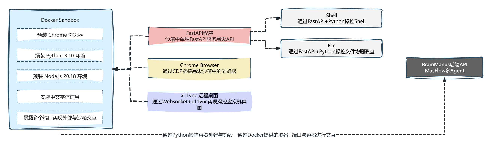

# 沙箱

## 1.沙箱是什么？为什么需要沙箱？
`沙箱` 是一种安全实践，可以在隔离环境或者 `沙箱` 进行测试，在沙箱中运行代码，在安全、隔离的环境中分析代码，而不会影响应用程序、系统或平台

### 技术流派：
#### 1. Docker 容器：最常用，隔离性好，但启动慢，开销资源大，Manus+Dify社区版插件系统使用的方案
#### 2. MicroVM：启动极快，硬隔离，Dify商业版插件系统使用的方案
#### 3. WASM (WebAssembly)：浏览器端或轻量级服务端沙箱，未来趋势，N8N前端浏览器执行Python/js代码使用的方案
#### 4. 阿里云/腾讯云Serverless函数计算：

